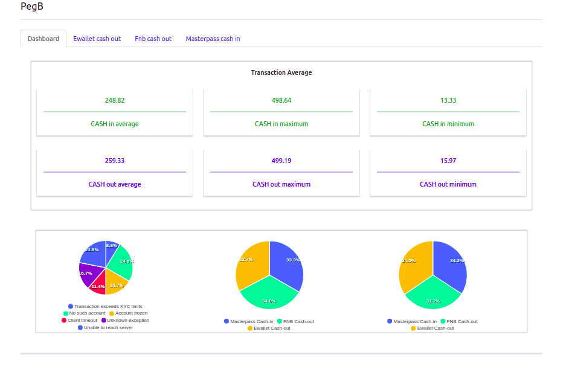
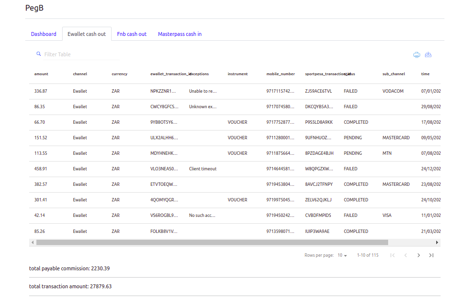

This project was bootstrapped with [Create React App](https://github.com/facebook/create-react-app).
The main idea behind use create-react-app. you don’t need to install or configure tools like webpack or Babel. 
They are preconfigured and hidden so that you can focus on the code.

## Folder Structure

- api
- assets 
- components
- views

### Runs the app in the development mode: `npm start`

Open [http://localhost:3000](http://localhost:3000) to view it in the browser.

### `npm test`
Not: now we don't have any test case.

### Deployment
Builds the app for staging/production to the `build` folder. `npm run build:staging/production` 

It correctly bundles React in production mode and optimizes the build for the best performance.
 
For Deploy build to your preferred server.
See the section about [deployment](https://facebook.github.io/create-react-app/docs/deployment) for more information.

### TODO
- add airbrake
- add ESLint
- add jest and write test case 
- add styled-components

## Learn More

You can learn more in the [Create React App documentation](https://facebook.github.io/create-react-app/docs/getting-started).

### screenshot

